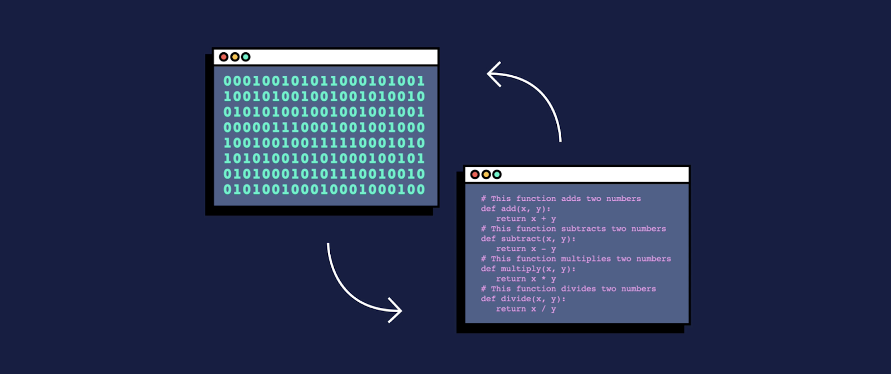

## Cos'è il linguaggio assembly
Come è noto, i processori sono in grado di elaborare solo sequenze di bit (zeri e uni di solito rappresentate da tensioni basse e alte). Un esempio di programma per un processore ad 8 bit potrebbe essere la sequenza

    00100111
    00100011
    10100010
    ...

Oltre ad essere incomprensibile ai non esperti (e anche ai più esperti), questo modo di programmare richiede agli sviluppatori di ricordare (più o meno a memoria) i codice necessari per indicare ogni operazione. Questo, oltre ad essere estremamente difficile, può anche portare a molti errori (in quanto è facile confondere due codici simili che, magari, fanno due operazioni completamente diverse).

Agli inizi dell'era dei processori (circa 1970 - 1980), si pensato di rimediare alla difficoltà del codice macchina binario utilizzando un meccanismo di descrizione delle istruzioni macchina più simile al linguaggio umano e quindi più facile da ricordare (si dice anche *mnemonico* perché facile da memorizzare). Questo modo di "riscrivere" il linguaggio binario prende il nome di **linguaggio assembly**. Va sempre tenuto a mente che il linguaggio assembly è solo un modo "facile" di scrivere istruzioni macchine binarie. Quindi bisogna sempre ricordarsi che ogni volta che si scrive un'istruzione assembly si sta in realtà scrivendo un'istruzione macchina, cioè una sequenza di bit, che il processore deve essere in grado di decodificare (*decode*) in una sequenza di operazioni (fetch operandi, addizione, ...).

## Software assemblatore (assembler)

Il passaggio dai codici binari ai codici assembly non vuol dire che i processori sono in grado di comprendere un linguaggio diverso da quello binario. La possibilità di usare istruzioni assembly è data dai speciali programmi che sono in grado di tradurre un'istruzione assembly nel linguaggio macchina della CPU, questi software sono chiamati **assembler**.

## Link
Scrivere ed eseguire assembly online
* <a src="https://kobzol.github.io/davis/" target="_blank">Assembly x86 (Intel e AMD)</a>
* <a src="https://wunkolo.github.io/OakSim/" target="_blank">Assembly ARM (Snapdragon e Apple)</a>
* <a src="https://www.cs.cornell.edu/courses/cs3410/2019sp/riscv/interpreter/" target="_blank">RISC V</a>
