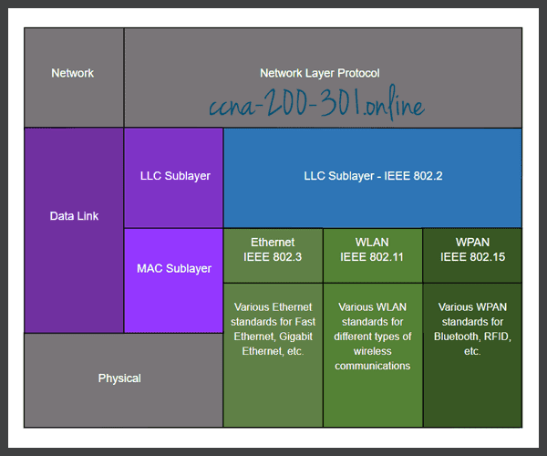

## Ruolo del livello di collegamento
Il <strong class="text-danger">livello di collegamento</strong> (*data link*) rappresenta il secondo livello dell'architettura ISO/OSI mentre è parte del livello di "Accesso alla Rete" nell'architettura TCP/IP di Internet. Trovandosi tra il livello di accesso al mezzo fisico ed il livello di rete, il ruolo del livello data link è di fornire un'*astrazione* del mezzo fisico utilizzato e della topologia della rete. In pratica i protocolli del livello di rete (ad esempio IPv4 e IPv6) devono essere "indifferenti" al tipo di mezzo fisico (es. rame vs wireless) e alla topologia della rete (es. point-to-point vs topologia a stella). Inoltre il livello data link si occupa di *indirizzare* i *nodi* della rete e di correggere eventuali errori che dovessero verificarsi nel collegamento tra due nodi.

Possiamo quindi identificare i seguenti ruoli del livello di collegamento

* Fornire un'interfaccia al livello di rete (attraverso opportuni Service Access Point)
* Incapsulare dentro **frame** di livello data link, i pacchetti ricevuti dal livello di rete
* **Indirizzare** i nodi connessi alla rete locale
* **Correggere gli errori** che si verificano sul link di rete locale
* Se necessario, gestire l'**accesso al mezzo fisico** condiviso (es. reti wireless)

Dal momento che questi aspetti sono molteplici e più meno suddivisi in aspetti di gestione del mezzo fisico e di interfacciamento con il livello di rete, il livello data link è solitamente suddiviso in due sottolivelli: *Media Access Control (MAC)* e *Logical Link Control (LLC)*.

## Suddivisione del livello data link

L'immagine a sinistra mostra la suddivisone del livello *data link* nei sottolivelli LLC e MAC. L'immagine mostra anche vari standard IEEE 802. Alcuni standard dell'IEEE si riferiscono sia al livello data link sia al livello fisico. Gli standard IEEE più noti ed utilizzati sono

* IEEE 802.2 che definisce il livello LLC
* IEEE 802.3 meglio noto come Ethernet
* IEEE 802.11 meglio noto come WiFi

Altri standard IEEE come Bluetooth, FDDI sono molto utilizzati, altri ancora sono stati importanti in passato, ad esempio Token Ring.

