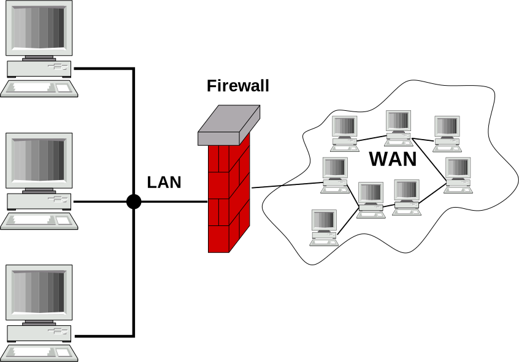

## Cos'è un firewall
Un aspetto importante delle reti è che tutto ciò che accade passa attraverso lo *scambio di pacchetti*. Una connessione ad un server HTTP avviene mediante l'incapsulamento di pacchetti TCP in pacchetti IP, lo scambio di informazioni tra i router di Internet avviene utilizzando specifici pacchetti ed anche **gli attacchi da parte di malintenzionati viaggiano su pacchetti** (sono escluse, ovviamente, attacchi che avvengono tramite l'introduzione di *malware* attraverso altri mezzi quali, ad esempio, chiavette USB). Questo suggerisce di mettere un controllo sui pacchetti per garantire che tutto quello che entra non sia dannoso e non abbia conseguenze negative.

<h5 class="no_toc"><i class="bi bi-journal-text"></i> Definizione</h5>
Un **firewall** è un dispositivo che controlla (monitora) la rete per garantire che i pacchetti in transito non contengano informazione indesiderate o dannose.

Come si vede nell'immagine a destra (fonte [Wikipedia](https://it.wikipedia.org/wiki/Firewall)), il firewall viene posizionato in modo che possa intercettare **tutto** il traffico che entra ed esce dalla rete. Qualsiasi altro modo sarebbe scorretto, infatti, se ci fosse una strada per aggirare il firewall, questa diventerebbe una vulnerabilità della rete.

Un firewall deve monitorare tutto il traffico, quindi deve essere in grado di analizzare enormi quantità di pacchetti in poco tempo scegliendo velocemente se far passare o meno un pacchetto, solo così si evitano ritardi inaccettabili.

Per gestire questa enorme quantità di lavoro, il firewall viene impostato utilizzando delle <strong class="text-danger">regole</strong> semplici che siano in accordo con la <strong class="text-danger">politica</strong> aziendale in termini di sicurezza e di uso della rete.

## Regole e politiche
Un firewall, quindi, è un dispositivo in grado di selezionare quali pacchetti far transitare sulla rete. Per fare questo deve decidere, per ogni pacchetto che vede, se farlo passare o eliminarlo, in altre parole il firewall deve avere delle **regole** che gli permettano di decidere della sorte di ogni pacchetto che transita.

I firewall moderni mettono a disposizione diverse regole che possono essere impostate dall'*amministratore di rete*, ma quali regole vanno impostate? La risposta a questa domanda non è universale. Alcuni pacchetti sono sempre indesiderati (quelli dannosi), ma altri potrebbero o meno essere ammessi.

Per fare un esempio ben noto, consideriamo pacchetti da a verso i *social media* (es. Facebook e Instagram), il firewall deve bloccare o lasciar passare questi pacchetti? La risposta dipende da chi gestisce la rete. Mentre in una casa è probabile che in firewall consenta tali pacchetti, in una scuola o in azienda, questi potrebbe essere impediti. In altre parole le regole che un amministratore di rete deve impostare su un firewall dipendono dalle **politiche** dell'azienda (es. la scuola). Se la politica aziendale è "Niente social media", allora nel firewall dovranno essere attivate tutte le regole che garantiscono questa politica. Le politiche possono essere anche più complesse, ad esempio l'azienda potrebbe concedere ai dipendenti di accedere ai social media durante la pausa pranzo, la politica diventa quindi "Niente social media, tranne dalle 12:00 alle 14:00", ovviamente le regole che l'amministratore di sistema deve impostare saranno più complicate.

<h5 class="no_toc"><i class="bi bi-pencil-square"></i> Esercizio</h5>
Immagina di essere il responsabile della gestione della rete in un'azienda di automobili. La rete interna interna è divisa in due grosse sotto-reti: "Rete produzione" e "Rete uffici", vuoi evitare che i dispositivi connessi alla prima rete ricevano pacchetti da Internet, ma allo stesso tempo devono poter comunicare con un server interno il quale è connesso ad Internet. Che politiche e regole imposteresti?

