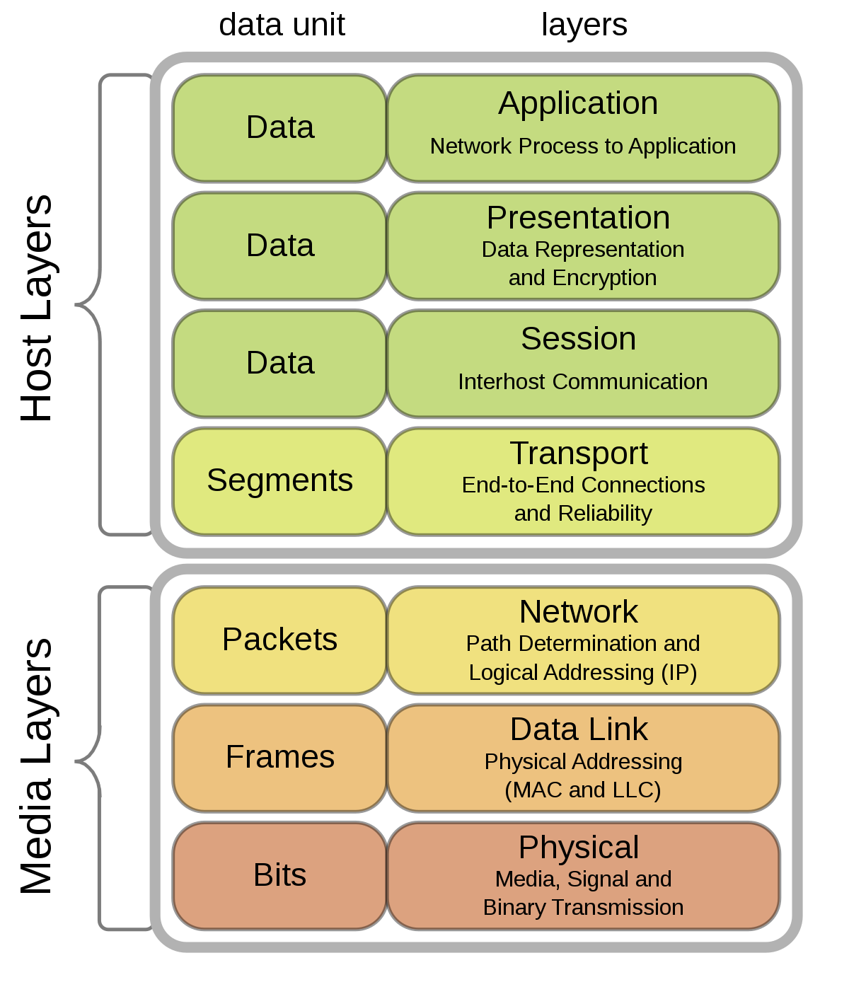
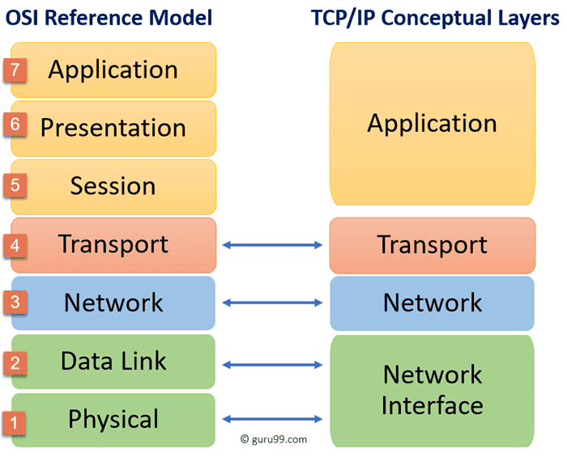

## La comunicazione
Per capire bene come funziona una rete, bisogna prima capire *a cosa serve* una rete. 



Nell'esempio di comunicazione rappresentato nella figura di sinistra, ci sono due persone che vogliono scambiarsi dell'informazione. Alice vuole che Bob le mandi l'ultimo versione del documento su cui lui sta lavorando. Bob è in *smart working* per la pandemia e manderà ad Alice una copia elettronica del documento richiesto. Notiamo che quando Alice chiede via email il documento a Bob, *Alice spedisce e Bob riceve*. Quando Bob manda il documento ad Alice, invece, Bob spedisce ed Alice riceve. In questo esempio *ci sono due diverse comunicazioni*.

Abbiamo visto che per comunicare Alice e Bob usano Internet, questo è il <strong class="text-alert">mezzo di comunicazione</strong> che hanno deciso di utilizzare. Se Bob non fosse stato in smart working, Alice avrebbe potuto chiedere a voce il documento a Bob. In questo caso il mezzo di comunicazione sarebbe stato quello orale (anziché Internet per spedire l'email). In questo caso Bob avrebbe potuto comunque mandare il documento in formato elettronico oppure stamparne una copia fisica e consegnarla ad Alice.

### Cos'è una comunicazione

<h5 class="no_toc"><i class="bi bi-journal-text"></i> Definizione</h5>

Una **comunicazione** è uno *scambio di informazioni* tra due entità, un **mittente** che *trasmette* l'informazione ed un **ricevente** che *riceve* l'informazione. Il mezzo (ad esempio Internet) con cui l'informazione viene trasmessa si chiama **canale (o mezzo) di trasmissione**.

### Studiare le reti
Lo studio delle reti ci permette di capire le reti, configurare le reti e risolvere problemi alla rete in modo che mittente e ricevente possano comunicare utilizzando come mezzo di comunicazione la rete stessa. Per poter far questo a *livello globale*, serve molto più che un semplice cavo di rame come nei "vecchi" sistemi telefonici. Quello che serve **è un complessa sistema di hardware e software che colleghi tra loro dispositivi diversi che possono anche trovarsi in posti distanti**. Il sistema che oggi si usa per le comunicazioni si chiama <strong class="text-danger">Internet</strong> (con la 'I' maiuscola!).

## Modelli a strati
Una rete come **Internet** è un artificio umano estremamente complesso. Si [stima](https://techjury.net/blog/how-many-iot-devices-are-there/) che ci siano più di *20 miliardi* di dispositivi connessi alla rete (quanti dei vostri dispositivi - PC, smartphone, PS5, ... - sono connessi ad Internet?). 

<h5 class="no_toc"><i class="bi bi-lightbulb"></i> Rifletti</h5>
Quanti e quali dispositivi sono connessi? Scrivi una risposta e solo dopo [clicca qui](https://drive.google.com/file/d/1hYZcGSvJinFby1Zbim6lS8mA3nOv6n_R/view) e rifletti sulla tua risposta. Aggiungeresti qualcosa alla lista dei tuoi dispositivi connessi?

Per gestire un sistema così complesso le reti moderne come Internet sono costruite basandosi su **architetture a strati** (l*ayered architecture*). Un'architettura di rete è l'insieme di tutte le componenti hardware e software che costituiscono la rete.
Il modello a strati viene di fatto utilizzato anche per spedire documenti fisici: [esempio](mail_encapsulation.html).



In una architettura a strati ci sono vari **livello** (4 nell'esempio a sinistra). I livelli più alti (numero più grande) fanno richieste ai livelli più bassi seguendo la regola che il ``livello n`` fa richieste solo al ``livello n-1``. Ad esempio, il ``livello 3`` può solo richiedere **servizi** al ``livello 2``. Queste richieste vengono fatte attraverso dei **Service Access Point** (**SAP**).

L'idea fondamentale è che ogni livello si occupa di un specifico problema della trasmissione su rete. Ad esempio il ``livello 1`` (quello più in basso che non può usare i servizi di nessuno) di solito è quello che spedisce i bit sul mezzo fisico (es. il cavo di rame per le reti cablate o l'etere per le reti wireless). Di contro, il livello più alto è quello che si occupa di prendere in carico la richiesta dell'utente (ad esempio l'URL digitato dall'utente sulla barra degli indirizzi del browser). 

### Modello ISO/OSI

L'ente internazionale di standardizzazione *International Organization for Standardization* (ISO) ha proposto un'architettura a strati chiama Open System Interconnection (OSI), da cui il nome **ISO/OSI**. Questo modello di architettura prevede 7 livelli.

1. Fisico (*physical*)
2. Collegamento (*data link*)
3. Rete (*network*)
4. Trasporto (*transport*)
5. Sessione (*session*)
6. Presentazione (*presentation*) 
7. Applicazione (*application*)

L'architettura ISO/OSI non è stata molto utilizzata principalmente perché l'architettura TCP/IP (vedi sotto) ha avuto maggior successo anche grazie al fatto che è l'architettura utilizzata dalla rete Internet.

### Modello TCP/IP

Anche la rete Internet utilizza un'architettura a strati chiamata **TCP/IP** o **Internet Suite Protocol**. Rispetto all'architettura ISO/OSI, questa contiene 4 livelli

1. Interfaccia di Rete (*network interface*)
2. Rete (*network*)
3. Trasporto (*transport*)
4. Applicazione (*application*)

Nella figura a sinistra si vede la corrispondenza tra i livelli ISO/OSI ed i livelli TCP/IP. Come si vede, due sono le differenze principali.

* Il livello applicazione di TCP/IP comprende tutti e tre i livelli più alto di ISO/OSI
* Il livello di interfaccia di rete di TCP/IP comprende i due livelli più bassi di ISO/OSI

## Protocolli di rete

<h5 class="no_toc"><i class="bi bi-journal-text"></i> Definizione: Protocollo</h5>
Un **protocollo di rete** è un *insieme di regole* che determinano il modo in cui avviene una
*comunicazione* tra due software. I protocolli sono usati da software che si posizionano allo
stesso livello del modello di riferimento.

La definizione appena data presenta diversi aspetti da capire.
* **Insieme di regole** proprio come nella comunicazione tra persone, è necessario che si
stabiliscano delle regole perché questa comunicazione possa avvenire. Le regole si stabiliscono
per garantire diversi *requisiti*
    * due persone devono in una lingua comprensibile ad entrambi;
    * se "distanti" le due persone devono utilizzare opportuni mezzi;
    * due persone non dovrebbero parlare contemporaneamente;
    * se la conversazione è riservata e remota, bisogna essere sicuri dell'identità interlocutore
* **Comunicazione** come visto sopra, lo scopo è, solitamente quello di effettuare una comunicazione,
vale a dire uno *scambio di informazioni*.
* **Livello del modello** nelle reti informatiche, le comunicazioni avvengono in modo che solo
gli stessi livelli possano comunicare *direttamente*. Questo viene effettuato principalmente per
garantire un "isolamento" dei vari livelli.

Per meglio capire il concetto di protocollo, vediamo alcuni esempi prese dalla comunicazione tra
persone.

<h5 class="no_toc"><i class="bi bi-journal-code"></i> Esempio: Che ore sono?</h5>
Supponiamo di trovarci per strada, con il telefono scarico e senza orologio ed avere
bisogno di conoscere l'ora. Quello che succederebbe sarà, più o meno la seguente cosa
1. si individua una persona disposta a rispondere (magari non al telefono, perché?);
2. si attira l'attenzione *Scusi?* e si aspetta una risposta (se non parla italiano?);
3. quando la persona mostra di essere disponibile si formula la richiesta *Che ore sono?*;
4. in attesa di risposta si lascia che la persona comunichi la risposta.

<h5 class="no_toc"><i class="bi bi-journal-code"></i> Esempio: Scambio di email</h5>
*Alice* e *Bob* vogliono scambiarsi delle informazioni riservate per il loro progetto
segreto. Utilizzano la mail per scambiarsi domande e idee sul progetto. 
1. Alice manda la sua idea a Bob 

    ``Ciao Bob, 
    ho pensato che potremmo inventare una macchina del tempo che ne dici?
    Alice``

2. Bob riceve la mail e risponde con quello che ne pensa. Nel frattempo Alice non
manda continuamente una mail (o un messaggio) chiedendo a Bob se ha letto la sua
idea.

