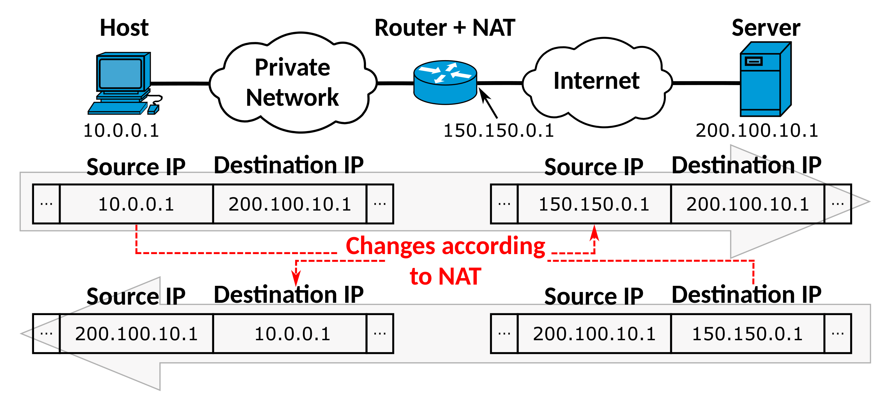
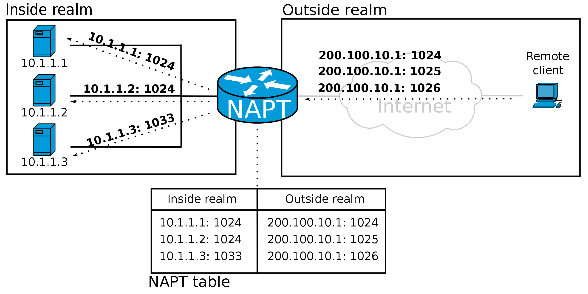

## Cos'è un NAT
NAT è una sigla che significa <strong class="text-alert">Network Address Translation</strong>, questa stessa sigla indica cosa fa un dispositivo NAT: *traduce indirizzi*. Più precisamente, si dovrebbe dire che un NAT *sostituisce* indirizzi in quanto esso sostituisce, all'interno di un  pacchetto IP (*datagramma*), un indirizzo con un altro.

## Utilizzi del NAT
Ci sono due principali utilizzi dei dispositivi NAT uno per mascherare la *topologia interna* della rete e l'altro per permettere a più dispositivi di condividere un *unico indirizzo IP pubblico* (ad esempio, nelle reti domestiche). Ovviamente, ci possono essere altri motivi per usare un meccanismo di traduzione di indirizzi, lo studente è invitato a trovarne alcuni.

### Mascherare la topologia di rete
Sappiamo che uno dei più importanti problemi nella gestione delle reti è la **sicurezza**, questo richiede di mantenere i dispositivi ed i servizi della rete al sicuro da attacchi esterni. Affinché un malintenzionato possa lanciare un attacco alla rete, questo deve conoscere come è fatta la rete: quali sono gli host, quali sono i loro indirizzi, che porte sono aperte, ... 

Un primo passo (importante, ma non sufficiente) verso la messa in sicurezza di una rete è nascondere quante più informazioni possibili. Un dispositivo NAT permette di fare questo in quanto i pacchetti che passano da un NAT non l'indirizzo IP originale, ma quello sostituito dal NAT.

### Utilizzo di un unico indirizzo IP
Prima dell'introduzione della versione 6, Internet era unicamente basata sulla versione 4 del protocollo IP (IPv4). Questa versione, pensata agli albori di Internet, prevedeva 32 bit per gli indirizzi permettendo circa 4 miliardi di indirizzi unici. Con la popolazione mondiale che sfiora 8 miliardi, il numero di dispositivi connessi è abbondantemente oltre il consentito da IPv4. Se oggi possiamo connettere computer, tablet, smartphone, televisori, frigoriferi, e quant'altro, c'è un sistema che permette di superare il limite, questo meccanismo è NAT (in futuro, con IPv6 che prevede 128 bit per ogni indirizzo NAT potrebbe non essere più necessario a questo scopo).

In pratica, ad ogni dispositivo viene assegnato un indirizzo IP locale, ad esempio ``192.168.1.100``, questo **non essendo un indirizzo pubblico**, non permette al dispositivo di accedere ad Internet. Tuttavia, all'interno della rete locale c'è un dispositivo speciale chiamato (default) gateway che riceve tutto il traffico destinato all'esterno (cioè non per la rete locale) e lo inoltra sostituendo l'indirizzo IP locale (``192.168.1.10``0 nel nostro esempio) con l'unico indirizzo IP che è disponibile (ad esempio ``1.2.3.4``). Questa operazione di traduzione è eseguita dal NAT. 

## Funzionamento del NAT

Come si vede nell'immagine a sinistra (fonte Wikipedia), l'operazione di un NAT è molto semplice. Quando il Router riceve un pacchetto dall'host 10.0.0.1, prima di mandarlo al Server 200.100.10.1, cambia l'indirizzo IP sorgente in 150.150.0.1 (l'indirizzo IP pubblico del router). 
Nel verso opposto, quando il router riceve un pacchetto dal server 200.100.10.1, sapendo che l'host 10.0.0.1 stava comunicando con tale server, sostituisce l'indirizzo IP pubblico 150.150.10.1 della destinazione con l'indirizzo dell'host 10.0.0.1 e inoltra il pacchetto così modificato verso la sua destinazione.
Cosa succede, tuttavia, se due host diversi, diciamo 10.0.0.1 e 10.0.0.2, della rete privata vogliono comunicare con lo stesso server 200.100.10.1? In questo caso si verifica un problema perché il router, quando riceve un pacchetto dal server, non saprà a chi mandarlo (cioè che IP sostituire al posto di 150.150.0.1).

### Nat mediante *Port Forwarding*

Nell'immagine a destra (fonte Wikipedia) si può vedere il funzionamento di un NAT in modalità port forwarding (a volte si usa la sigla NAPT per questi dispositivi). L'idea è che per distinguere le connessioni che arrivano dalla rete locale (chiamata inside realm nell'immagine), il dispositivo NAT utilizza le proprie porte di uscita per le connessioni. In altre parole un NAT di questo tipo non solo cambia l'indirizzo IP da quello privato a quello pubblico, ma cambia anche la porta della sorgente utilizzandone una che esso ha libera (NATP: Network Address/Port Translation). In questo modo si risolve il problema dell'identificare le connessioni verso lo stesso server effettuate da più host della rete privata. Infatti il NAT utilizzerà l'IP del server e la porta per capire a quello host della rete privata dovrà inviare il pacchetto.

