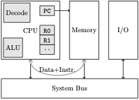

## Cos'è un sistema di elaborazione
Innanzitutto, iniziamo definendo cosa intendiamo per *sistema di elaborazione*.
Un <strong class="text-danger">sistema di elaborazione</strong> è un qualsiasi strumento che produca, autonomamente, un **output** a partire da un **input**  fornito da chi utilizza il sistema. Si parla di sistema di elaborazione poiché l'input viene trasformato (*elaborato*) per ottenere l'output. Per brevità, useremo anche i termini *elaboratore e calcolatore* per indicare un sistema di elaborazione.

### Esempi di sistemi di elaborazione
Nella vita di tutti i giorni usiamo decine si sistemi di elaborazione (spesso senza nemmeno rendercene conto), vediamo alcuni esempi.
* Spesso le sveglie sono impostate su uno *smartphone* che è un potentissimo elaboratore. Anche le sveglie più "classiche", sono sistemi di elaborazione (sebbene molto semplici). Sia che usiamo il nostro cellulare sia che usiamo una sveglia, l'input che diamo è l'ora attuale e l'ora in cui la sveglia deve suonare mentre l'output è il suono (e/o vibrazione) che ci fa alzare dal letto.
* Il *televisore* che accendiamo appena ci sediamo a fare colazione, è un sistema di elaborazione. L'input è il canale che scegliamo e il segnale che viene ricevuto mediante la presa dell'antenna. L'output è rappresentato da audio e video.
* Il *computer di bordo* di un auto o di un moderno bus sono degli elaboratori che prendono input dai nostri comandi e da tutti i sensori che sono installati sull'auto. L'output è rappresentato dalle informazioni della plancia.
* Il *computer* che il docente usa per la lezione in aula è un sistema di elaborazione. L'input è rappresentato dai comandi impartiti con tastiera e mouse, ma anche dai programmi precedentemente installati (es. Windows, Chrome, Word, ...). L'output, ovviamente, dipende dai comandi impartiti (es. file copiato su una chiavetta, registro elettronico, documento word, ...).

**Esercizio continua** l'elenco dei sistemi di elaborazione che incontri durante il giorno pensando a cosa fai dal momento in cui esci da scuola fino al momento in cui vai a dormire.

### Sistema programmabile
Tra le tantissime differenze che ci sono tra i veri sistemi di elaborazione, una è particolarmente importante ed è la **programmabilità**. Diciamo che un sistema è **programmabile** se possiamo cambiare il tipo di elaborazione cioè la *relazione tra input e output*.

Chiaramente la sveglia non è programmabile (possiamo impostare l'ora, ma non possiamo certo usarla per scrivere un documento). Al contrario un computer (o uno smartphone) possono essere programmati nel senso che possiamo scrivere un programma che ci permetta di usarlo come sveglia, per scrivere documenti, per giocare e per molte altre cose. Sia che installiamo un software (o una App), sia che scriviamo noi il codice, quello che facciamo è dare **istruzioni** al sistema di elaborazione perché faccia certe operazioni specifiche. Ad esempio, il programma Word conterrà, tra le altre, le istruzioni per mostrare a schermo il testo digitato sulla tastiera.

Il programmatore, si occupa di scrivere software per sistemi programmabili (ad esempio scrivere un App Android). Fortunatamente, non serve imparare da zero la programmazione per ogni dispositivo programmabile. Per esempio è possibile creare un software per Windows e per Android usando (quasi) lo stesso codice Java. Ciò è possibile perché nei vari sistemi programmabili i componenti sono organizzati in maniera simile. Si dice che questi sistemi utilizzano la stessa *architettura*. L'architettura più importante è quella di *von Neumann* che è alla base di quasi tutti i sistemi di elaborazione. Per questo motivo cercheremo di capire questo modo di organizzare un elaboratore.

### Architettura di un sistema di elaborazione

  
Definizione: <strong>Architettura di un sistema di elaborazione</strong>

  

    

        Si chiama <strong>architettura</strong> di un sistema di elaborazione il modo in cui i vari componenti sono collegati tra loro ed il modo in cui questi componenti interagiscono per ottenere l'elaborazione input/output.
    

  

## Architettura di von Neumann

    
Nell'immagine a sinistra si vede uno schema dell'architettura di von Neumann. Essa è composta dalla **CPU** (*Central Processing Unit*) la quale è collegata alla **memoria** (chiamata anche **RAM** - *Random Access Memory*) ed ai dispositivi di **I/O** (*Input/Output*) tramite il **Bus di sistema** (un vero e proprio circuito). 

Una caratteristica importante dell'architettura di von Neumann è che le **istruzioni del programma da eseguire sono memorizzate nella stessa memoria (la RAM) che contiene i dati**. Si parla quindi di architettura a **programma memorizzato** (*stored program*) che differisce da architettura a **programma fisso** (*fixed memory*). Le architetture a programma fisso sono utilizzate in dispositivi che fanno una cosa specifica quali: calcolatrici (non programmabili), lavatrici, ... Le architetture a programma memorizzato (come l'architettura di von Neumann) sono utilizzate in quasi tutti i dispositivi programmabili: computer, smartphone, tablet, Arduino, console, ...

### Come funziona l'architettura di von Neumann

Un sistema basato sull'architettura di von Neumann utilizza il **fetch-and-execute** (recupera ed esegui) per eseguire un programma. Le istruzioni che compongono il programma si trovano in sequenza nella RAM (il sistema operativo le *carica* quando il programma il programma viene avviato). Ogni programma ha una prima *istruzione* (in Java questo è l'inizio del metodo Main). La CPU, partendo da questa *prima istruzione*, procede nel seguente modo
1. Recupera (*fetch*) dalla RAM la prossima istruzione da eseguire
2. Legge (*decode*) questa istruzione per capire cosa deve fare
3. Se necessario, carica gli operandi (*operands*) dalla memoria
4. Esegue l'istruzione (*execute*)
5. Ritorna al punto 1.
Questo funzionamento prosegue fino a che la CPU non viene *interrotta*. Il funzionamento sarà più chiaro quando parleremo di [CPU e Assembly](cpu_fetch_execute.html).

### Le componenti dell'architettura di von Neumann
Vediamo ora in dettaglio qual'è il compito delle quattro componenti principali dell'architettura di von Neumann: CPU, memoria, I/O e bus.

#### CPU
La **CPU** (Central Processing Unit) è il "cervello" di un calcolatore. Si tratta di un sistema molto complesso in grado di eseguire istruzioni relativamente semplice (perlopiù operazioni matematiche) ad una elevatissima velocità. Una CPU moderna può sommare 1 miliardi di numeri in un secondo. La CPU deve sempre avere una *prossima istruzione da eseguire*. Nell'architettura di von Neumann queste istruzioni sono memorizzate (insieme ai dati) nella *memoria centrale*.

#### Memoria centrale
La **memoria centrale** è un "contenitore" di informazioni (*bit*). Nell'architettura di von Neumann la memoria centrale contiene i **dati** (ad esempio una sequenza di numeri da sommare) e le **istruzioni**. Le istruzioni sono le operazioni fondamentali che la CPU è in grado di eseguire. Mettendo tante istruzioni uno dopo l'altra si crea un prog*ramma.

#### Bus
Siccome la CPU deve prendere dati e istruzioni dalla memoria, queste due componenti devono essere collegate. Il "filo" che le collega di chiama **bus di sistema**. Si tratta di un vero e proprio collegamento (visibile anche nel parte inferiore di una scheda madre) che permette a CPU e memoria di scambiarsi informazione (*bit*). È importante ricordare che la CPU può sia leggere che scrivere sulla memoria. Ad esempio la CPU legge dalla memoria due variabili \\( x \\) ed \\( y \\), le somma e poi scrive sulla memoria il risultato \\( x+y \\).
Nei sistemi di elaborazione moderni, il bus di sistema è composto di tre bus.
1. **Bus indirizzi** che viene usato dalla CPU per indicare l'indirizzo di memoria a cui si vuole accedere (in lettura o in scrittura)
2. **Bus dati** che viene usato dalla CPU e dalla memoria per scambiarsi i dati
3. **Bus di controllo** che serve alla CPU, alla memoria ed ai dispositivi di I/O per gestire e coordinare le varie operazioni che fanno funzionare il sistema.

#### I/O
Quanto abbiamo visto finora (CPU, memoria e bus) basta per creare una calcolatore. In pratica, però, è necessario leggere input (ad esempio dalla tastier) e/o mostrare output (ad esempio sullo schermo). Questo operazioni di **Input/Output** o **I/O** sono gestite da dei *controller* che sono collegati alla CPU e alla memoria attraverso il bus di sistema.

____

## Esercizi di programmazione

1. Scrivi un programma Java che si comporta come il processore facendo *fetch-and-execute*. Nel fetch il programma chiede un istruzione dalla console (*fetch*). Se questa istruzione è ``STOP`` allora il programma termina altrimenti scrive sullo schermo l'istruzione data (*execute*) e poi si rimette in attesa della nuova istruzione dall'utente.
2. Nel programma precedente aggiungete il numero di istruzione eseguita quando viene stampata a video. In caso di istruzione ``STOP``, scrivere il numero totale di istruzioni eseguite dal programma.

## Domande di ripasso
1. Cos'è un sistema di elaborazione? Cos'è che viene elaborato? <strong class="text-success">FACILE</strong>
2. Secondo te un sistema programmabile è più facile o più difficile da costruire di un sistema non programmabile? Perché? <strong class="text-warning">MEDIA</strong>
3. Cos'è l'architettura di un elaboratore? <strong class="text-success">FACILE</strong>
4. Perché è un bene che molti dispositivi abbiano la stessa architettura? <strong class="text-danger">DIFFICILE</strong>
5. Come funziona un computer che si basa sull'architettura di von Neumann? <strong class="text-warning">MEDIA</strong>