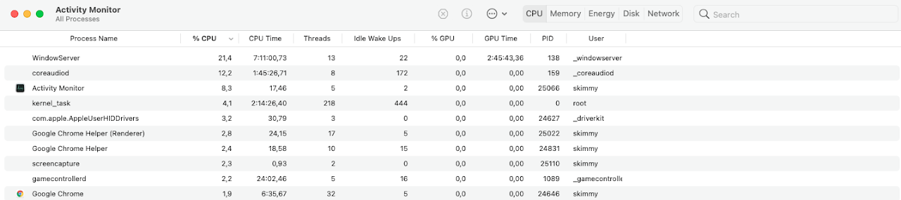
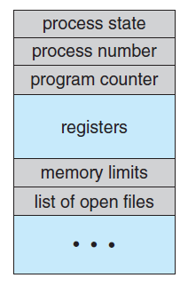
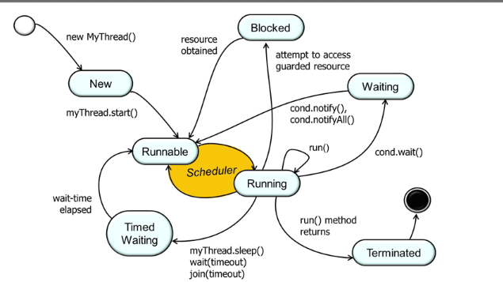

## Processi e Thread

Definizione: <strong>Processo</strong>

Un <strong class="text-danger">processo</strong> è un *programma in esecuzione*. I processi sono entità gestite dal sistema operativo il quale assegna le **risorse** (CPU, memoria, file, ...) ai processi.

È importante sottolineare che *processo e programma* ***non*** *sono la stessa cosa*. Ad esempio, un programma di video-scrittura con due finestre (file) corrisponde a due processi diversi (uno per ogni finestra). In questa situazione il *programma* è sempre lo stesso (es. Word), ma due processi diversi sono in *esecuzione*. Semplificando un po', il *programma è l'insieme di istruzioni e dati memorizzati sul file eseguibile* (es. Word.exe), mentre il processo è *tutto ciò che serve affinché il programma sia eseguito*. Aiuta pensare ad un programma come qualcosa che non cambia (a meno che non si installi una nuova versione), mentre ad un processo come qualcosa che cambia nel tempo. Per esempio lo stesso programma di video-scrittura può essere aperto una volta con il file ``pippo.docx`` e la volta dopo con il file ``pluto.docx``, i due processi corrispondenti saranno diversi (ma il programma sarà lo stesso).

Definizione: <strong>Thread e Schedulazione</strong>

Un <strong class="text-danger">thread</strong> (*filo*) è una *parte di programma in esecuzione*. Ad esempio, l'esecuzione di un metodo Java che aspetta l'input dalla tastiera si può realizzare con un thread. Un processo può generare (*spawn*) più di un thread. Di fatto, **il sistema operativo schedula i thread sulla CPU** (non i processi).

<strong class="text-danger">Schedulare</strong> un thread significa metterlo in esecuzione su un *core* (ricordiamo che oggi i processori hanno diversi core, ogni core può eseguire un thread).

I thread sono simili ai processi nel senso che sono *unità di esecuzione* e hanno bisogno che la CPU gli venga *allocata* (messa a disposizione) dal sistema operativo. Tuttavia, i thread sono più "snelli" da gestire perché il sistema operativo non tiene tutta l'informazione che tiene per i processi (es. file aperti, pagine di memoria, ...). Per questo motivo i thread si possono considerare **processi leggeri**.

Inoltre i thread possono essere usati dai programmatori per gestire quelle situazione in cui il programma può continuare l'esecuzione anche se si è in attesa di input. Ad esempio, in un videogame, il personaggio controllato dal giocatore si muove a seguito dell'input (da controller o tastiera + mouse). Se il giocatore non fornisce alcun comando il personaggio rimane fermo, ma il resto dello scenario viene comunque aggiornato. Un programmatore può usare un thread per fare il *rendering* del personaggi controllato e uno o più thread per tutti gli altri.

### Vedere processi e thread nei sistemi operativi
Tutti i sistemi operativi mettono a disposizione dei *programmi di utilità* che permettono di controllare quali processi sono in esecuzione. In Windows questo programma viene chiamato *task manager*, in Mac Os si usa un programma chiamato *activity monitor* (nella versione in inglese). Un modo per vedere i processi in esecuzione su un sistema Linux è attraverso il comando ``ps -el`` della console comandi (*bash*).

Il programma *activity monitor* di Mac OS mostra tutti i processi attualmente gestiti dal sistema operativo (qui ne sono mostrati solo alcuni). Oltre al nome del processo (spesso il programma) si vede anche il numero di thread (quarta colonna) e il ``PID`` (*Process ID*, penultima colonna) che lo identifica univocamente.

## Descrizione di un processo
Come detto sopra, il processo è l'unità fondamentale gestita dal sistema operativo. Per capire meglio come il sistema operativo gestisca i processi dobbiamo vedere più in dettaglio come è fatto un processo e cosa il sistema operativo memorizza e gestisce. Per meglio capire i processi, qui sotto ci occuperemo di
* *spazio di memoria* associata al processo,
* *stato* di un processo e
* *process control block*.
Per concludere la prima parte della discussione, parleremo di *context switch*.

### Lo spazio di memoria di un processo
Abbiamo già detto che un processo è un *programma in esecuzione*, tutti programmi hanno bisogno di uno 
<strong class="text-danger">spazio di memoria</strong> RAM dove vengono mantenute le *istruzioni* ed i
*dati*. Come tutte le risorse hardware, anche **la memoria è gestita dal sistema operativo** che decide
come *allocarla* ai vari processi. Quando un nuovo processo viene, una zona di memoria gli viene assegnata
dal sistema operativa. In questa zona di memoria si trovano:
* il codice del programma e
* dati e le variabili e variabili del programma

Nella figura a sinistra vediamo come viene organizzato lo spazio di memoria di un processo. Dal basso verso
l'alto incontriamo le seguenti zone di memoria
* *Text* che contiene il codice macchine del programma che si sta eseguendo.
* *Data* che contiene le variabili globali o variabili statiche del programma
* *Heap* che contiene la memoria dinamica (creata con ``new`` in Java e C++ o con ``malloc`` in C)
* *Stack* che contiene le variabili locali (ad esempio le variabili non statiche dichiarate dentro un metodo).

Per meglio gestire la memoria, il sistema operativo fornisce ai processi uno spazio fisso (ad esempio 4KB)
di memoria. Se il processo ne usa di meno, allora lo spazio tra heap e stack non sarà completamente utilizzato.
Infatti si nota che stack e heap (che cambiano mentre il programma viene eseguito) occupano lo spazio libero
(zona azzurra nella figura) andando uno verso l'altro (come indicato dalle frecce nere).

Se il processo ha bisogno di più spazio di quanto allocato, lo chiede al sistema operativo il quale alloca
dell'ulteriore memoria al processo (se ne ha a disposizione). Il meccanismo utilizzato dal sistema operativo
per assegnare memoria ai processi si chiama **paginazione della memoria**.

<strong class="text-primary">Approfondimenti</strong> sullo spazio di memoria
* Dove finiscono le variabili Java?
* Cosa succede quando un processo chiede "troppa" memoria?

### Lo stato di un processo
Un processo in esecuzione può sospendersi in attesa di un evento che gli permetta di procedere. Ad esempio
un programma di video-scrittura sarà sempre in attesa di un nuovo tasto digitato dalla tastiera. Dal momento
che il sistema operativo deve garantire un po' di tempo processore a tutti i processi attivi su un computer,
è possibile usare i tempi di attesa di un processo per far proseguire un altro processo che era in attesa del
processore. Il sistema operativo può sospender un processo anche se questo non è in attesa. In questo modo si 
può dare la CPU ad altri processi che altrimenti rimarrebbero troppo a lungo sospesi. Si dice in questo caso
che il sistema operativo fa *preempting* (pre-rilascio) della CPU. Le regole secondo cui il sistema operativo
decide come gestire la CPU vanno sotto il nome di **scheduling** della CPU.

Da quanto detto sopra si vede che un processo può trovarsi in diversi <strong class="text-danger">stati</strong>
ed è quindi necessario che il sistema operativo tenga traccia dello stato di ognuno dei processi. Inoltre, il
sistema operativo si deve preoccupare di spostare un processo da uno stato ad un altro quando opportuno.

Nell'immagine a sinistra vediamo i 5 stati in cui un processo si può trovare.
* **New**: il processo è stato creato, ma ancora non è stato inserito tra i processi che sono pronti per l'esecuzione.
* **Ready**: il processo è sospeso, ma può eseguire istruzioni non appena verrà messo in esecuzione
* **Running**: il processo sta eseguendo su un qualche core del processore
* **Waiting**: il processo è sospeso e sta aspettando un evento esterno e quindi non è pronto per essere immediatamente eseguito (si noti che manca la freccia da *waiting* a *running*).

### IL Process Control Block (PCB)

Il sistema operativo deve tenere traccia di tutte le informazioni relative ad un processo. Tali informazioni
sono raccolte nel <strong class="text-danger">Process Control Block (PCB)</strong>. Cosa viene tenuto nel PCB
dipende dal sistema operativo, ma alcune informazioni sono sempre presenti.
* Process number o *process identifier* (PID)
* *Process state*
* *Program counter*
* *Registri della CPU*
* Informazioni sulla *memoria* del processo
* *Lista dei file* aperti dal processo
* Qualsiasi informazioni necessaria a gestire il processo

### Context switch

Un sistema operativo che fa un buon lavoro di gestione dei processi, fa si che *un processo non accorga che è stato spostato da un core, messo in waiting per un po' e poi rimesso in esecuzione*. Per faro questo, è necessario che il processo riportato su un core dopo che è stato messo in waiting ritrovi "tutto come era". Questo significa che il sistema operativo deve tenere traccia nel PCB di tutti i registri della CPU in modo da poterli ripristinare quando necessario. Questi registri rappresentano il **contesto del processo** (*context*) e l'operazione di scambio dei contesti di due processi viene detta **context switch** (*cambio di contesto*).

Si noti come il PCB contiene tutte le informazioni del contesto di un processo ed è quindi usato dal sistema operativo nelle operazioni di context switch. È importante sottolineare che *il context switch è un'operazione che richiede molto tempo* ed è quindi una cosa da evitare quanto più possibile. Tuttavia in un sistema con tanti processi e "pochi" core, sarà necessario fare context switch molto di frequente.

<strong class="text-primary">Nota</strong> Il context switch è un'operazione così importanti che molti processori (es. Intel dal 80386 in poi) hanno dei circuiti e delle istruzioni apposite. Queste permette di rendere più veloce ed efficiente l'operazione.

## Processi vs Thread

### Memoria
Ricordiamo che uno dei compiti del sistema operativo è quello di *gestire la memoria* per allocarla ai vari processi quando questi ne abbiano bisogno. È estremamente importante che questa gestione della memoria sia **sicura**. Ad esempio non vogliamo che qualche mal intenzionato inserisca del codice Javascript su un sito che può copiare o cancellare i documenti o i file di sistema. Per questo motivo il processo del browser non deve poter accedere alla stessa memoria del processo di sistema che gestisce il filesystem. Per questo si dice che g**li spazi di memoria (o spazi di indirizzo) dei processi sono separati**.

Al contrario i thread sono tutti parte dello stesso processo e per questo motivo *condividono* lo stesso spazio di memoria. In pratica ogni thread di un processo può accedere a tutte le variabili di qualsiasi altro thread dello stesso processo (ovviamente per fare questo deve avere un *valido riferimento*)

<h5 class="card-title no_toc">Processi</h5>

<ul>
<li>Process ID (PID)</li>
<li>Registri salvati</li>
<li>File e risorse salvate</li>
<li>Spazi di memoria separati</li>
<li>Comunicazione solo con <em>Inter-Process Communication</em> (IPC)</li>
</ul>

<h5 class="card-title no_toc">Thread</h5>

<ul>
<li>Thread ID (TID)</li>
<li>Registri salvati</li>
<li>File e risorse non salvate</li>
<li>Spazio di memoria condiviso</li>
<li>Comunicazione principalmente con condivisione memoria</li>
</ul>

## Scheduling dei thread



L'immagine a sinistra mostra cosa succede in un processore con 4 core quando il sistema operativo decide di spostare un processo (Steam in questo caso) dallo stato Running allo stato Ready o Waiting mettendo in esecuzione un altro processo (Word in questo caso) nel core che si libera in questo modo. Notiamo come il processo Steam e finito nell *coda dei processi* in attesa che il sistema operativo lo rimetta in esecuzione sul processore. Allo stesso modo, il processo Word che viene messo in esecuzione sul core libero, è stato preso dalla coda dei processi.

## Thread state
Come i processi, anche i thread possiedono uno **stato** che descrive in che situazione si trova il thread. L'insieme dei possibili stati di un thread è più ampio di quello dei processi in quanto è possibile mettere i thread in *sleep* per un periodo di tempo prestabilito. Inoltre è possibile utilizzare [primitive di sincronizzazione](sincronizzazione.html) per sospendere temporaneamente un thread in attesa di una *notifica* da parte di un altro thread.

### Thread state in Java

La figura a sinistra mostra il diagramma degli stati per un thread Java. Si notano subito alcune differenze importanti con il diagramma di stato dei processi.
* Lo stato waiting dei processi corrisponde allo stato **blocked** nella figura a sinistra
* Un thread Java entra nello stato **waiting** (figura a sinistra) quando si mette in *attesa di una notifica da parte di uno a più altri thread*.
* Lo stato **timed waiting** (non presente nel diagramma di stato dei processi) corrisponde ad uno stato *temporizzato* ovvero uno stato in cui il thread rimane per un massimo di tempo impostato dal programmatore, allo scadere di questo tempo (*timer*) il thread viene messo in esecuzione.

